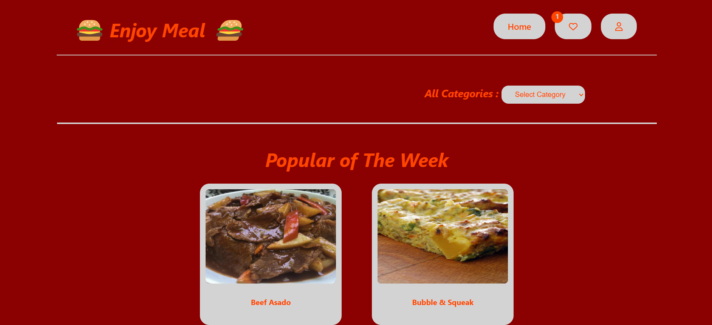

# JS-EnjoyMeal-js App

## Description

### Meal App - Built with HTML, JavaScript, CSS, and Object-Oriented Programming (OOP)

This web app allows users to explore a variety of meals by selecting different categories. On the first render, the app showcases the popular meals of the week, offering users a curated selection of meals to get started. The app fetches meal data from a fake API and displays a list of meals for each category. By clicking on a meal, users can view detailed recipe instructions.

The app also includes a Favorites list, where users can save meals they like for later. You can easily access, add, or remove meals from your Favorites list, and all of this data is stored locally in your browser’s storage.
The app is built using Object-Oriented Programming (OOP) principles to manage meal data and user interactions efficiently.

